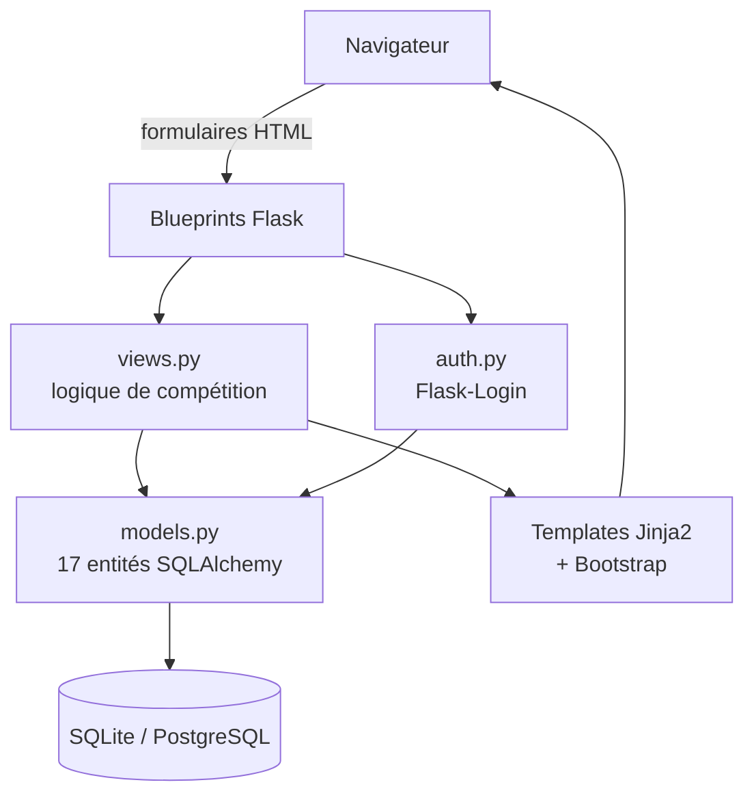
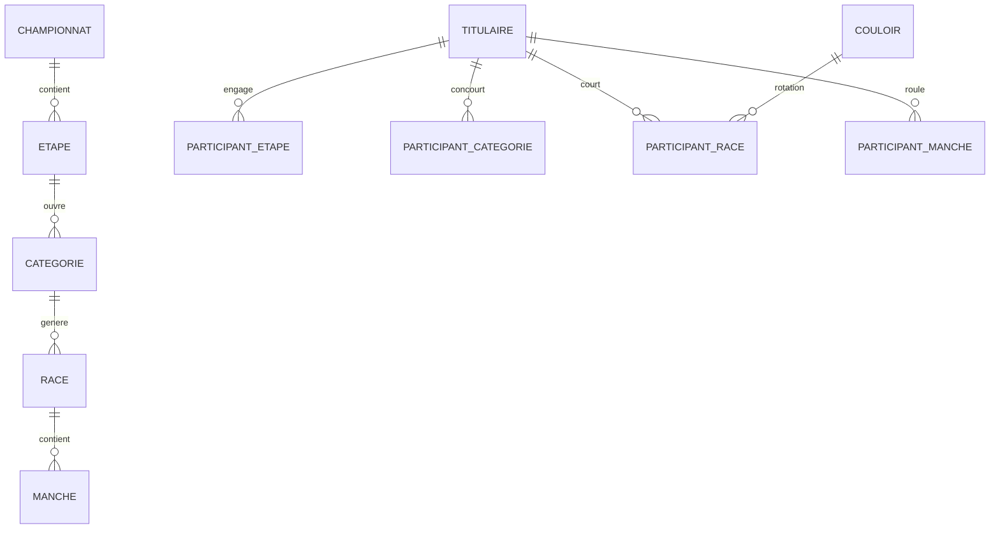
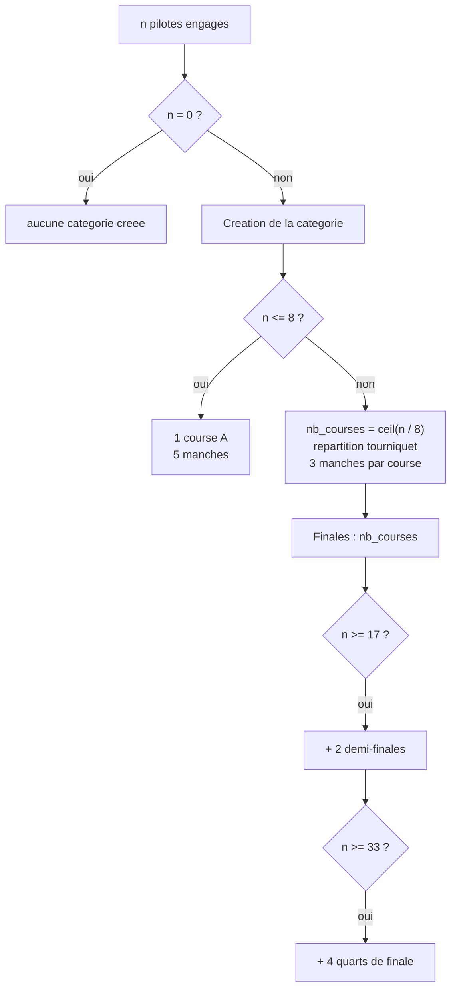

# Architecture et spécifications techniques

Ce document décrit le modèle de données, les algorithmes de génération de courses et
les règles de calcul des points. Il s'adresse à un lecteur technique qui veut
comprendre *comment* l'application décide, sans lire les 1 300 lignes de `views.py`.

---

## 1. Vue d'ensemble

L'application est un monolithe Flask classique, en rendu serveur.



| Couche | Fichier | Rôle |
| --- | --- | --- |
| Entrée HTTP | `source/app.py` | point d'entrée, lance le serveur de développement |
| Fabrique | `source/website/__init__.py` | `create_app()`, configuration, enregistrement des blueprints |
| Authentification | `source/website/auth.py` | connexion/déconnexion, hachage Werkzeug |
| Métier | `source/website/views.py` | génération des courses, progression des phases, scores |
| Persistance | `source/website/models.py` | 17 entités SQLAlchemy |
| Amorçage | `source/seed.py` | données de référence + compte local |

---

## 2. Modèle de données

Une compétition se lit de haut en bas : un **championnat** se déroule sur plusieurs
**étapes**, chaque étape ouvre des **catégories** d'âge, chaque catégorie génère des
**courses**, et chaque course se dispute en plusieurs **manches**.



### Pourquoi quatre tables `Participant_*`

Un pilote est rattaché à quatre niveaux différents, et chacun porte une information
qui lui est propre :

| Table | Information portée |
| --- | --- |
| `participant_etape` | engagement à l'étape + catégorie déduite de l'âge |
| `participant_categorie` | appartenance au plateau de la catégorie |
| `participant_race` | **rotation de couloirs attribuée** + total de points de la course |
| `participant_manche` | **couloir de départ de cette manche** + place d'arrivée |

Fusionner ces tables obligerait à dupliquer la rotation sur chaque manche, ou à
recalculer le couloir de départ à chaque affichage.

### Machine à états d'une catégorie

La table `categorie` porte sept drapeaux booléens qui pilotent la progression :

```
pool_finie ──► quart_genere ──► quart_finie ──► demi_genere ──► demi_finie ──► finale_genere ──► finale_finie ──► finie
```

Une phase n'est générée que si la précédente est terminée **et** que la phase n'a pas
déjà été générée. C'est ce qui rend le bouton « Générer la prochaine phase »
idempotent : le cliquer deux fois ne duplique pas les courses.

---

## 3. Algorithme de brassage des couloirs

### Le problème

En BMX, le couloir de départ n'est pas neutre : les couloirs intérieurs (1 à 4)
donnent un avantage dans le premier virage. Faire courir cinq manches en laissant
chaque pilote au même couloir fausserait le classement.

Il faut donc une table de rotation telle que :

1. dans une même manche, **deux pilotes n'occupent jamais le même couloir** ;
2. sur l'ensemble des manches, **un pilote ne reprend jamais un couloir déjà pris** ;
3. l'exposition aux couloirs intérieurs est **équilibrée entre tous les pilotes**.

### La solution retenue

Une table de 8 rotations × 5 manches, stockée en base (`couloir`). Chaque **ligne**
est la suite de couloirs d'un pilote au fil des manches ; chaque **colonne** est la
grille de départ d'une manche.


C'est un **carré latin 8 × 5** (rectangle latin). Les trois propriétés sont
vérifiables :

| Propriété | Vérification |
| --- | --- |
| Colonnes | chacune des 5 manches est une permutation complète de `{1..8}` — aucun couloir occupé deux fois |
| Lignes | les 5 valeurs d'une ligne sont distinctes — aucun pilote ne reprend un couloir |
| Équité | chaque pilote obtient **2 ou 3 départs intérieurs sur 5** — écart maximal de 1 entre pilotes |

Vous pouvez le revérifier vous-même :

```bash
python scripts/verify_lane_rotation.py
```

### Attribution

À la création d'une course, les rotations sont **mélangées** (`random.shuffle`) avant
d'être distribuées aux pilotes, puis chaque manche lit la colonne correspondante :

```python
couloirs = Couloir.query.all()
random.shuffle(couloirs)                     # personne n'a la rotation 1 par défaut
...
participant_race.couloir_id = couloirs[i].id # rotation attribuée pour toute la course
...
place_depart = couloir.couloir_1             # manche 1
place_depart = couloir.couloir_2             # manche 2, etc.
```

Le mélange évite qu'un pilote hérite systématiquement de la rotation la plus
favorable d'une étape à l'autre.

---

## 4. Algorithme de génération des courses

Tout part du nombre de pilotes engagés dans une catégorie.



### Cas 1 — jusqu'à 8 pilotes

Une seule course `A`, disputée en **5 manches**. Le plateau tient dans une grille,
il n'y a rien à qualifier : le classement final est le cumul des 5 manches.

### Cas 2 — 9 pilotes et plus

Le nombre de poules est `ceil(n / 8)`, et les pilotes sont répartis en **tourniquet**
plutôt que par blocs :

```python
participants_par_race = [0] * nb_races
for i in range(nb_participants):
    participants_par_race[i % nb_races] += 1
```

La répartition tourniquet garantit un écart maximal d'un pilote entre poules. Avec
un découpage par blocs, 9 pilotes donneraient 8 + 1 — une poule à un seul concurrent.

| Pilotes | Poules | Répartition | Manches/poule | Phases finales |
| ---: | ---: | --- | ---: | --- |
| 8 | 1 | `[8]` | 5 | — |
| 9 | 2 | `[5, 4]` | 3 | 2 finales |
| 16 | 2 | `[8, 8]` | 3 | 2 finales |
| 17 | 3 | `[6, 6, 5]` | 3 | 2 demi + 3 finales |
| 33 | 5 | `[7, 7, 7, 6, 6]` | 3 | 4 quarts + 2 demi + 5 finales |

La liste des pilotes est mélangée avant répartition, pour qu'un même club ne se
retrouve pas systématiquement groupé.

### Vérification sur le jeu de démonstration

60 pilotes, 6 catégories :

```
9/10 ans    10 pilotes → 2 poules [5, 5]
11/12 ans   12 pilotes → 2 poules [6, 6]
13/14 ans   16 pilotes → 2 poules [8, 8]
15/16 ans    8 pilotes → 1 poule  [8]      (5 manches)
17/24 ans    8 pilotes → 1 poule  [8]      (5 manches)
25/40 ans    6 pilotes → 1 poule  [6]      (5 manches)
```

Total produit par l'application : **6 catégories, 15 courses, 33 manches,
224 participations**.

---

## 5. Calcul des points

Le BMX se classe **au plus petit total** : la place d'arrivée est le nombre de points.

| Situation | Points |
| --- | ---: |
| 1ᵉ d'une manche | 1 |
| 2ᵉ | 2 |
| … | … |
| 8ᵉ | 8 |
| Non partant / abandon | **9** |

Le total d'un pilote sur une course est la somme de ses places sur toutes les manches
de cette course :

```python
for manche in race.manches:
    for participation in manche.participations:
        resultats[participation.titulaire_id] += participation.resultat
```

La pénalité de 9 pour un abandon est volontairement supérieure à la pire place
possible : ne pas partir doit coûter davantage que finir dernier.

### Note de portabilité

Les places d'arrivée arrivent du formulaire sous forme de chaînes. SQLite les
convertit silencieusement grâce à l'affinité `INTEGER`, mais PostgreSQL — proposé
dans `.env.example` — refuse une chaîne dans une colonne entière. La conversion est
donc explicite à la saisie (`int(place_arrive)`), avec repli sur 9 si la valeur est
invalide.

---

## 6. Limites connues

Ces points sont documentés parce qu'ils comptent avant tout usage réel :

- **Les règles de progression ne sont pas certifiées.** Le nombre de qualifiés par
  phase suit une logique interne qui doit être confrontée au règlement de la
  fédération concernée avant toute compétition officielle.
- **La couverture de tests est minimale** : un test de fumée sur la page de
  connexion. La logique de génération, qui est le cœur métier, mérite un test par
  palier de participants (8, 9, 16, 17, 33).
- **`views.py` fait 1 300 lignes.** Un découpage en blueprints par domaine
  (pilotes, championnats, courses) faciliterait la maintenance.
- **Pas d'historique inter-étapes.** Le classement général d'un championnat sur
  plusieurs étapes n'est pas calculé.
- **Les égalités ne sont pas départagées.** Deux pilotes à total identique ne sont
  pas départagés par la meilleure manche, contrairement à l'usage courant.
