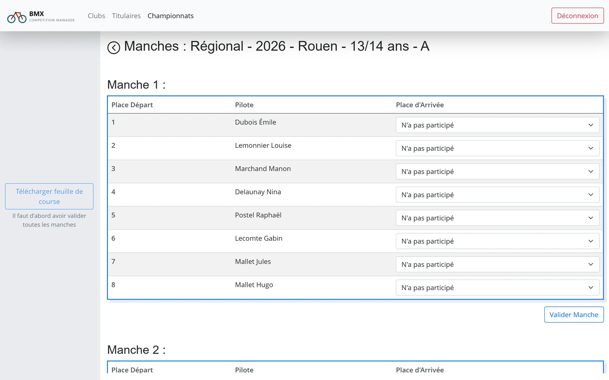
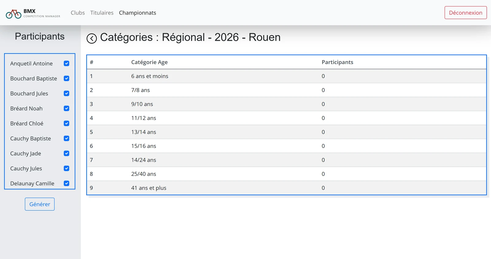
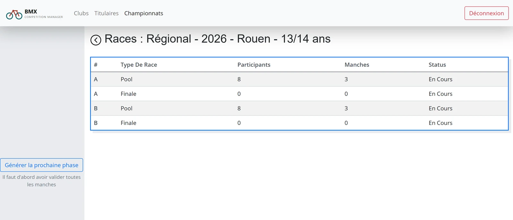
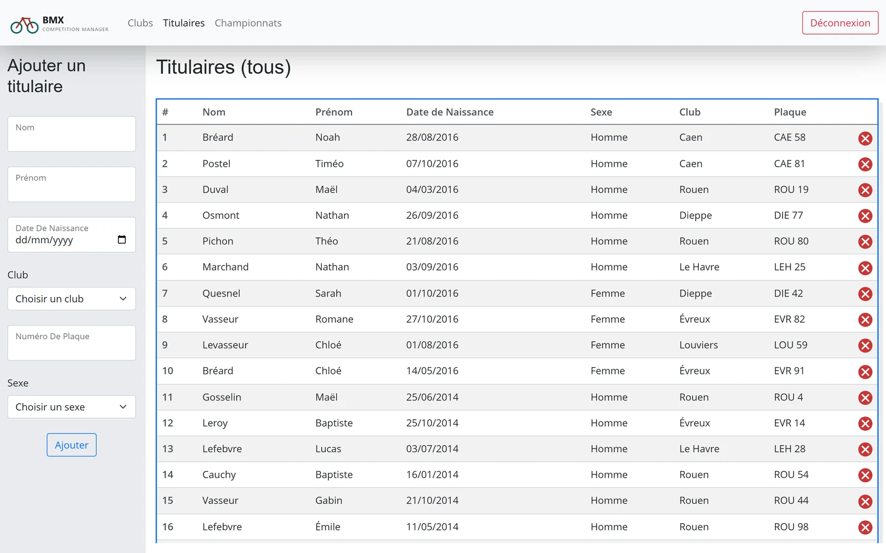
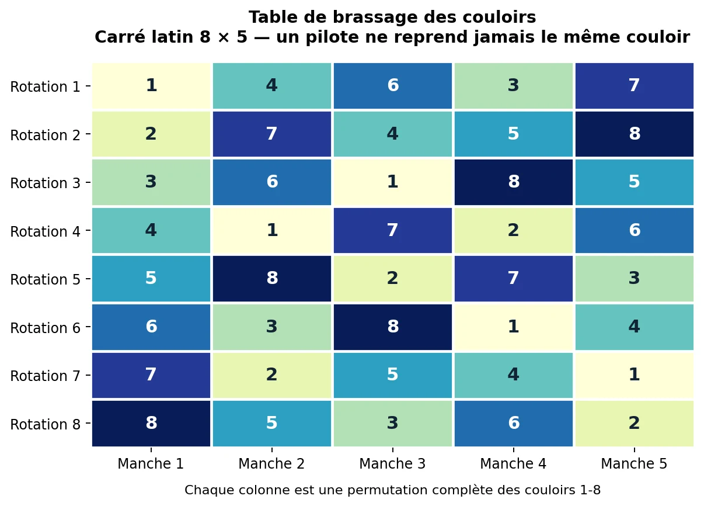

# BMX Competition Manager

[](https://github.com/juleescourne/bmx-competition-manager/actions/workflows/tests.yml)


[](LICENSE)

Application web de gestion de championnats BMX : engagement des pilotes, génération
automatique des poules et des phases finales, brassage équitable des couloirs de
départ et saisie des résultats.

> Projet issu de mon portfolio Data — [juleescourne.github.io/portfolio-data-analyst](https://juleescourne.github.io/portfolio-data-analyst/)



---

## Le problème résolu

Organiser une étape de championnat BMX demande, pour chaque catégorie d'âge, de
répartir les pilotes en poules, de leur attribuer des couloirs de départ différents
à chaque manche, puis de faire progresser les qualifiés vers les phases finales.
Fait à la main, c'est long et source d'erreurs — d'autant que le couloir de départ
influence directement le résultat.

L'application prend une liste de pilotes engagés et produit l'intégralité de la
structure de course. Sur le jeu de démonstration, **60 pilotes cochés donnent
6 catégories, 15 courses, 33 manches et 224 participations** en une validation.

---

## Ce que le projet démontre

| Domaine | Éléments concrets |
| --- | --- |
| Modélisation relationnelle | 17 entités, 4 tables d'association, clés étrangères et machine à états |
| Algorithmique | carré latin 8 × 5 pour le brassage, répartition en tourniquet, progression de phases idempotente |
| Backend Python | Flask, blueprints, SQLAlchemy, Flask-Login, hachage Werkzeug |
| Qualité | données de démonstration reproductibles, script de vérification de l'algorithme, intégration continue |

---

## Aperçu

| Engagement des pilotes | Courses générées |
| --- | --- |
|  |  |

Liste des pilotes, filtrable par club, avec plaque préfixée par les initiales du club :



---

## Le brassage des couloirs en une image

En BMX, les couloirs intérieurs avantagent au premier virage. Laisser un pilote au
même couloir sur cinq manches fausserait le classement.

La table de rotation est un **carré latin 8 × 5** : chaque colonne est une
permutation complète des couloirs 1 à 8, et aucun pilote ne reprend jamais un
couloir déjà emprunté.



Les trois propriétés sont vérifiables en une commande :

```bash
python scripts/verify_lane_rotation.py
```

```
1. Aucun couloir occupé deux fois dans une même manche
   [OK]   manche 1 : permutation complète de 1..8
   ...
3. Équilibre des départs intérieurs (couloirs 1-4)
   -> écart entre le plus et le moins favorisé : 1
   [OK]   équilibré (écart maximal d'un départ)

Carré latin valide.
```

Le raisonnement complet est détaillé dans [ARCHITECTURE.md](ARCHITECTURE.md#3-algorithme-de-brassage-des-couloirs).

---

## Démarrage rapide

```bash
git clone https://github.com/juleescourne/bmx-competition-manager.git
cd bmx-competition-manager
python -m venv .venv && source .venv/bin/activate   # .\.venv\Scripts\Activate.ps1 sous Windows
pip install -r requirements.txt

python source/seed.py --username admin --password "un-mot-de-passe-local"
python -c "import sqlite3; sqlite3.connect('source/instance/bmx.db').executescript(open('db/demo_data.sql', encoding='utf-8').read())"
python source/app.py
```

Puis <http://127.0.0.1:5000>. Comptez cinq minutes, données de démonstration
comprises.

Détail des étapes et dépannage : [INSTALLATION.md](INSTALLATION.md).

---

## Documentation

| Document | Contenu |
| --- | --- |
| [INSTALLATION.md](INSTALLATION.md) | prérequis, installation pas à pas, configuration, problèmes courants |
| [UTILISATION.md](UTILISATION.md) | parcours complet d'une compétition, écran par écran |
| [ARCHITECTURE.md](ARCHITECTURE.md) | modèle de données, algorithmes de brassage et de génération, calcul des points |

---

## Stack

`Python 3.10+` · `Flask 3` · `SQLAlchemy 2` · `Flask-Login` · `SQLite` (ou PostgreSQL)
· `Jinja2` · `Bootstrap 5` · `pytest` · `GitHub Actions`

Cinq dépendances d'exécution seulement.

---

## Jeu de démonstration

`db/demo_data.sql` charge un championnat régional normand complet : 6 clubs
(Rouen, Le Havre, Évreux, Dieppe, Caen, Louviers), 60 pilotes répartis sur
6 catégories d'âge, 1 championnat 2026 et 2 étapes.

Le script ne contient **ni compte ni empreinte de mot de passe** — les identifiants
restent créés par `seed.py`. Il ne pré-remplit pas non plus les courses : c'est
l'application qui les génère, et elle efface toute structure existante à chaque
validation de l'écran Catégories.

---

## Limites assumées

- Les règles de qualification **ne sont pas certifiées** par une fédération et
  doivent être confrontées au règlement applicable avant tout usage officiel.
- La couverture de tests est minimale (un test de fumée) ; la logique de génération
  mériterait un test par palier d'effectif (8, 9, 16, 17, 33).
- Pas de classement général cumulé sur plusieurs étapes, pas de départage des
  égalités.

Ces points, et les défauts corrigés lors de la publication du dépôt, sont détaillés
dans [ARCHITECTURE.md](ARCHITECTURE.md#6-limites-connues).

---

## Licence

[MIT](LICENSE) — Jules Courné
