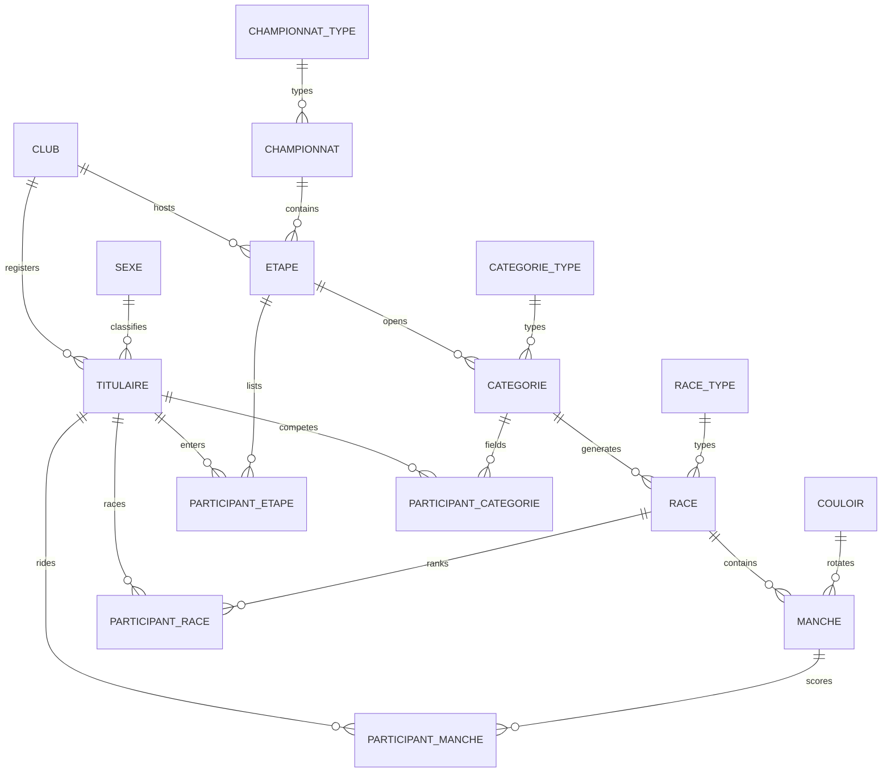

# BMX Competition Manager

[](https://github.com/juleescourne/bmx-competition-manager/actions/workflows/tests.yml)

[](LICENSE)

A Flask web application for managing BMX championships and race events.

> Part of my Data portfolio: [juleescourne.github.io/portfolio-data-analyst](https://juleescourne.github.io/portfolio-data-analyst/)

The application manages riders, clubs, championships, event stages, age categories, race phases, lane assignments and results through a relational SQLAlchemy data model. It also contains the competition logic used to generate race structures and advance riders between phases.

## What this project demonstrates

- Relational data modelling with SQLAlchemy
- Python backend development with Flask
- Authentication with Flask-Login
- CRUD workflows for riders, clubs and championships
- Generation of race pools and elimination phases
- Automated lane rotation / assignment
- Result entry and score aggregation
- Server-rendered HTML templates and a Bootstrap-based interface

## Tech stack

`Python` · `Flask` · `SQLAlchemy` · `Flask-SQLAlchemy` · `Flask-Login` · `SQLite` · `HTML/CSS` · `Bootstrap` · `JavaScript`

## Data model

A championship is split into stages; each stage opens age categories; each category
generates races (pools, then quarter-, semi- and finals); each race is run over several
heats. Riders enter at stage level and are then attached to the category, race and heat
they take part in — which is why four separate `Participant_*` association tables exist.



| Table | Role |
| --- | --- |
| `titulaire` | Rider identity, licence number and club |
| `club` / `sexe` | Reference tables |
| `championnat` / `etape` | A championship and its stages |
| `categorie` | An age category opened for a stage, with its progression flags |
| `race` / `manche` | Races within a category, and the heats within a race |
| `couloir` | Lane-rotation patterns applied across heats |
| `participant_*` | The four association tables linking riders to stage, category, race and heat |

The `categorie` table carries the progression state of a category (`pool_finie`,
`quart_genere`, `demi_finie`, `finale_genere`…), which is what drives the automatic
generation of the next phase.


## Project structure

```text
BMX/
├── .github/workflows/tests.yml
├── source/
│   ├── app.py
│   ├── seed.py
│   └── website/
│       ├── __init__.py
│       ├── auth.py
│       ├── models.py
│       ├── views.py
│       ├── static/
│       └── templates/
├── tests/
│   └── test_smoke.py
├── .env.example
├── .gitignore
├── requirements.txt
└── requirements-dev.txt
```

## Local setup

### 1. Create a virtual environment

```bash
python -m venv .venv
```

Linux/macOS:

```bash
source .venv/bin/activate
```

Windows PowerShell:

```powershell
.\.venv\Scripts\Activate.ps1
```

### 2. Install dependencies

```bash
pip install -r requirements.txt
```

### 3. Initialize the database

The SQLite database is created locally in `instance/bmx.db` and is intentionally excluded from Git.

Initialize the reference tables and create a local login account:

```bash
python source/seed.py --username admin --password "choose-a-local-password"
```

Do not reuse a real password here. This command is intended for a local development account.

### 4. Run the application

```bash
python source/app.py
```

Then open:

```text
http://127.0.0.1:5000
```

## Configuration

The application can be configured through environment variables:

```text
SECRET_KEY=<long-random-secret>
DATABASE_URL=<SQLAlchemy database URI>
```

If `DATABASE_URL` is omitted, the application uses a local SQLite database in the Flask instance directory. If `SECRET_KEY` is omitted, a temporary development secret is generated when the application starts.

See `.env.example` for examples. The application does not automatically load `.env`; export the variables in your shell or configure them in your deployment environment.

## Tests

Install development dependencies:

```bash
pip install -r requirements-dev.txt
```

Run:

```bash
pytest -q
```

A small GitHub Actions workflow runs the smoke test on pushes and pull requests.

## Maintenance notes

This is an existing application that has been cleaned for publication rather than rewritten from scratch. Several unambiguous runtime issues from the original code were corrected, including invalid foreign-key assignments, inconsistent relationship names, plate-number validation and quarter/semi-final variable mistakes.

The competition progression code contains domain-specific rules for different rider counts. Those rules should be validated against the intended BMX competition regulations before using the application for an official event, and additional tests should be added for each participant-count boundary.

## Suggested GitHub topics

`python` `flask` `sqlalchemy` `sqlite` `relational-database` `data-modeling` `backend` `competition-management`
