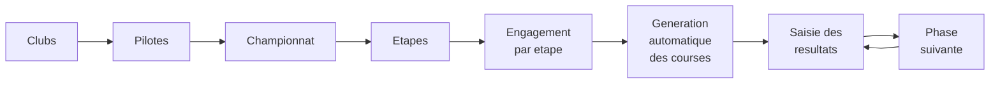

# Guide d'utilisation

Ce guide suit le déroulé réel d'une compétition : on saisit d'abord les clubs et les
pilotes, puis on crée le championnat et ses étapes, on engage les pilotes, et
l'application génère les courses.

Les chiffres cités correspondent au jeu de démonstration (`db/demo_data.sql`) :
6 clubs, 60 pilotes, 1 championnat 2026, 2 étapes.

---

## Vue d'ensemble du parcours

---

## 1. Se connecter

Toutes les pages sauf la connexion exigent une session ouverte. Utilisez le compte
créé à l'installation.

Le champ « Se rappeler de moi » conserve la session au-delà de la fermeture du
navigateur.

---

## 2. Clubs

**Menu → Clubs**

Un club est identifié par sa ville et ses initiales, toutes deux **uniques**. Les
initiales font au plus 5 caractères et servent de préfixe au numéro de plaque
affiché dans les listes : un pilote de Rouen portant la plaque 19 apparaît en
`ROU 19`.

Le club sert aussi de **lieu** pour une étape : une étape se déroule sur la piste
d'un club.

---

## 3. Pilotes

**Menu → Titulaires**

Chaque pilote porte un nom, un prénom, une date de naissance, un numéro de plaque
(1 à 2 caractères), un club et un sexe.

> **La date de naissance est déterminante.** L'application en déduit la catégorie
> d'âge par `année du championnat − année de naissance`. Un pilote né en 2012 court
> en « 13/14 ans » sur un championnat 2026. La catégorie n'est jamais saisie à la
> main.

La liste est filtrable par club. Le numéro de plaque n'est pas unique au niveau
national : deux clubs peuvent avoir chacun leur numéro 19.

---

## 4. Championnats et étapes

**Menu → Championnats**

Un championnat porte une **année** et un **type** (Régional, Départemental). Le type
fixe le nombre maximal d'étapes : 5 pour un régional, 4 pour un départemental.

Depuis un championnat, ouvrez **Étapes** pour ajouter les manches du calendrier, en
choisissant le club qui reçoit.

---

## 5. Engager les pilotes et générer les courses

**Championnat → Étape → Catégories**

C'est l'écran central. Cochez les pilotes engagés, puis validez.

L'application effectue alors, en une seule opération :

1. le calcul de la catégorie d'âge de chaque pilote engagé ;
2. la création des catégories effectivement représentées ;
3. la répartition des pilotes en poules ;
4. l'attribution d'une rotation de couloirs à chaque pilote ;
5. la création des manches, avec le couloir de départ de chacune ;
6. la création des phases finales adaptées à l'effectif.

Sur le jeu de démonstration, cocher les 60 pilotes produit **6 catégories,
15 courses, 33 manches et 224 participations**.

> **Attention — cette validation est destructive.** Elle efface puis régénère
> l'intégralité de la structure de l'étape : participants, courses, manches et
> résultats déjà saisis. Ne revalidez pas cet écran une fois la compétition
> commencée.

Le détail des règles de répartition est documenté dans
[ARCHITECTURE.md](ARCHITECTURE.md#4-algorithme-de-génération-des-courses).

---

## 6. Suivre les courses

**Étape → une catégorie**

L'écran liste les courses de la catégorie avec, pour chacune, son type (Pool,
1/4 Finale, 1/2 Finale, Finale), son nombre de participants, son nombre de manches
et son statut.

Une catégorie de 16 pilotes affiche par exemple deux poules `A` et `B` de 8 pilotes
sur 3 manches, plus deux finales encore vides.

---

## 7. Saisir les résultats

**Une course → une manche**

Pour chaque pilote, indiquez sa place d'arrivée. Le bouton
**Télécharger feuille de course** produit la grille de départ à imprimer pour les
commissaires.

Le classement se fait **au plus petit total** : la place d'arrivée vaut son nombre
de points, et le total du pilote est la somme sur toutes les manches de la course.

| Situation | Points |
| --- | ---: |
| Vainqueur d'une manche | 1 |
| Deuxième | 2 |
| Huitième | 8 |
| Non partant ou abandon | **9** |

La pénalité de 9 est volontairement supérieure à la dernière place : ne pas partir
doit coûter plus cher que finir dernier.

Une manche validée est marquée terminée. Lorsque toutes les manches d'une course le
sont, la course est close automatiquement.

---

## 8. Passer à la phase suivante

**Écran des courses → Générer la prochaine phase**

Le bouton reste inactif tant que toutes les manches de la phase en cours ne sont pas
validées — le message « Il faut d'abord avoir validé toutes les manches » l'indique.

Une fois la phase close, l'application calcule les totaux, qualifie les pilotes et
remplit la phase suivante en réattribuant des rotations de couloirs.

L'enchaînement dépend de l'effectif de la catégorie :

| Effectif | Enchaînement |
| ---: | --- |
| 1 à 8 | poule unique sur 5 manches, pas de phase finale |
| 9 à 16 | poules → finales |
| 17 à 32 | poules → demi-finales → finales |
| 33 et plus | poules → quarts → demi-finales → finales |

L'opération est idempotente : générer deux fois la même phase ne crée pas de
doublon, grâce aux drapeaux d'état portés par la catégorie.

---

## Ce que l'application ne fait pas

Ces limites sont assumées et documentées :

- **pas de classement général** cumulé sur plusieurs étapes d'un championnat ;
- **pas de départage des égalités** — deux pilotes à total identique ne sont pas
  départagés par leur meilleure manche, contrairement à l'usage ;
- **les règles de qualification ne sont pas certifiées** par une fédération et
  doivent être confrontées au règlement applicable avant tout usage officiel ;
- **pas de gestion des licences** ni de contrôle de leur validité.
